  

 

# Hi, I'm Tulsi Kumar Yadav 👋

### **Software Engineer • AI/ML Engineer • LLM & RAG Developer • Backend Engineer**

  
  &nbsp;
  
  &nbsp;
  
  &nbsp;
  
  &nbsp;
  

 

## ⚡ About Me

I am a software engineer focused on building practical AI systems, LLM/RAG applications, and scalable backend APIs. I enjoy transforming complex technical concepts into clean, reliable, and high-performance software solutions.

 

<table width="100%">
  <tr>
    <td width="33%" valign="top">
      <h4>🤖 AI Systems</h4>
      
Building AI-powered applications using Generative AI, LLMs, prompt engineering, and intelligent automation workflows.

    </td>
    <td width="33%" valign="top">
      <h4>🔎 RAG Pipelines</h4>
      
Developing Retrieval-Augmented Generation systems using embeddings, Sentence Transformers, FAISS, and semantic search.

    </td>
    <td width="33%" valign="top">
      <h4>⚙️ Backend Engineering</h4>
      
Designing database-driven applications and REST APIs using Python, Django, FastAPI, Flask, SQL, and Django ORM.

    </td>
  </tr>
</table>

 

  

 

## 🚀 Featured Projects

<table width="100%">

  <!-- Project 1 -->

  <tr>
    <td>
      <h3>🏢 LLM Regulatory Intelligence System</h3>
      
End-to-end AI application for processing regulatory documents and generating structured compliance insights. Implements document ingestion, preprocessing, semantic search, vector retrieval, and automated regulatory analysis to reduce manual compliance reporting effort by approximately 60%.

      
<code>Python</code> • <code>FastAPI</code> • <code>LLMs</code> • <code>RAG</code> • <code>Sentence Transformers</code> • <code>FAISS</code>

      
🔗 <a href="https://github.com/tulsikumar18/AI-Assisted-regulatory-For-Corep"><b>View Repository →</b></a>

    </td>
  </tr>

  <!-- Project 2 -->

  <tr>
    <td>
      <h3>🌾 AgriAid — Smart Agricultural Assistant</h3>
      
<b>🏆 1st Place Winner — Hacktopus Hackathon (50+ Teams)</b>

      
Multimodal AI assistant supporting text, image, and voice inputs for agricultural problem solving, multilingual assistance, and AI-powered recommendations for improved accessibility.

      
<code>Python</code> • <code>FastAPI</code> • <code>Computer Vision</code> • <code>NLP</code> • <code>Gemini API</code>

      
🔗 <a href="https://github.com/tulsikumar18/AgriAid"><b>View Repository →</b></a> &nbsp;|&nbsp; 🎥 <a href="https://drive.google.com/file/d/13oJG7U6W43YkJlChiFagw9NCBynm2deI/view?usp=sharing"><b>Watch Demo Video</b></a>

    </td>
  </tr>

  <!-- Project 3 -->

  <tr>
    <td>
      <h3>🏛️ JanMitra — AI Civic Issue Reporting Platform</h3>
      
Full-stack civic issue reporting platform built to help citizens report, track, and manage civic issues. Includes issue submission, status tracking, notifications, rewards, search and filtering, location-based visualization, and AI-assisted issue classification.

      
<code>Python</code> • <code>Django</code> • <code>JavaScript</code> • <code>HTML/CSS</code> • <code>SQL</code> • <code>REST APIs</code> • <code>Gemini API</code> • <code>Leaflet</code>

      
🔗 <a href="https://github.com/tulsikumar18/JanMitra"><b>View Repository →</b></a> &nbsp;|&nbsp; 🌐 <a href="https://janmitra-in-django.onrender.com"><b>Live Demo →</b></a> &nbsp;|&nbsp; 🎥 <a href="https://drive.google.com/file/d/1aYaxH5cLpfeuPLmhs3hzhXONh7Na-Wl_/view?usp=sharing"><b>Watch Demo Video</b></a>

    </td>
  </tr>

</table>

 

## 🧰 Core Stack & Achievements

### 💻 Programming & Web Development

  
  
  
  
  

### ⚙️ Backend & APIs

  
  
  
  
  

### 🗄️ Databases & Data

  
  
  
  

### 🤖 AI / ML & Generative AI

  
  
  
  
  
  
  
  

### 🛠️ Developer Tools & Core CS

  
  
  
  
  
  

> 🏆 **1st Place Winner** — Hacktopus Hackathon 2025 (AgriAid • 50+ Teams)

 

## 📊 GitHub Activity

  
  &nbsp;
  

 

  

 

  <h3>Let's build something interesting.</h3>
  

    <a href="mailto:tulsikumaryadavamcec@gmail.com"><b>Get in Touch ✉️</b></a> &nbsp;|&nbsp;
    <a href="https://www.linkedin.com/in/tulsi-kumar-yadav-2b749627a"><b>Connect on LinkedIn 💼</b></a> &nbsp;|&nbsp;
    <a href="https://tulsikumar-portfolio.vercel.app"><b>Visit Portfolio 🌐</b></a>
  

 

  

