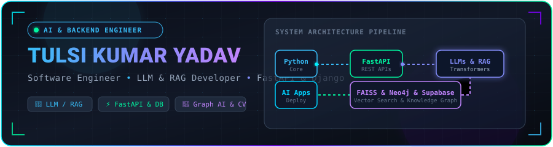
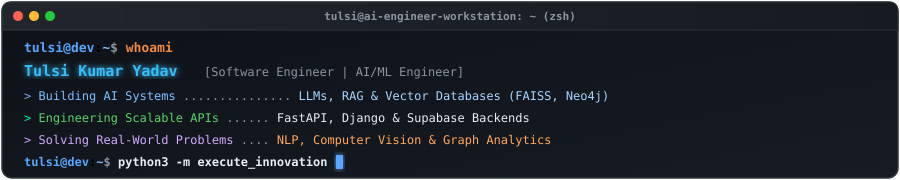
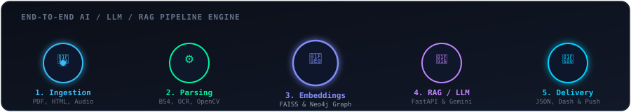

<div align="center">
  
</div>

<br />

<div align="center">
  
</div>

<br />

# Hi, I'm Tulsi Kumar Yadav 👋

### **Software Engineer • AI/ML Engineer • LLM & RAG Developer • Backend Engineer**

📍 **Bengaluru, Karnataka, India** &nbsp;|&nbsp; 📧 [tulsikumaryadavamcec@gmail.com](mailto:tulsikumaryadavamcec@gmail.com) &nbsp;|&nbsp; 🌐 [Portfolio](https://tulsikumar-portfolio.vercel.app) &nbsp;|&nbsp; 💼 [LinkedIn](https://www.linkedin.com/in/tulsi-kumar-yadav-2b749627a)

---

## 💡 About Me

I am a passionate **Software Engineer** and **AI/ML Engineer** specializing in building production-grade **LLM/RAG applications**, scalable **FastAPI/Django backend systems**, intelligent document-processing pipelines, and multimodal AI solutions.

With a strong foundation in **Data Structures & Algorithms, Object-Oriented Design, and Database Systems**, I focus on transforming complex artificial intelligence research into robust, high-performance web applications and backend APIs.

```text
┌────────────────────────────────────────────────────────────────────────────────────────┐
│  🎓 B.E. Computer Science & Engineering (Data Science) @ AMC Engineering College (VTU) │
│  📊 Academic GPA: 8.76 / 10  •  Bengaluru, Karnataka                                   │
│  🏆 1st Place Winner — Hacktopus Hackathon 2025 (50+ Participating Teams)              │
│  📜 Certified: Oracle Generative AI Professional (2025) & IBM SQL Developer (2024)     │
└────────────────────────────────────────────────────────────────────────────────────────┘
```

---

<div align="center">
  
</div>

## ⚡ What I'm Building

<table width="100%">
  <tr>
    <td width="50%" valign="top">
      <h3>🤖 LLM Applications & Agentic AI</h3>
      <p>Architecting practical generative AI workflows, structured JSON generation, multi-turn prompt engineering, and intelligent chatbots using Gemini API & LLMs.</p>
      <sub><b>Tech:</b> Python, LLMs, Gemini API, Prompt Engineering</sub>
    </td>
    <td width="50%" valign="top">
      <h3>🔎 Retrieval-Augmented Generation (RAG)</h3>
      <p>Building high-accuracy semantic retrieval pipelines combining web scraping, document parsing (PDF/HTML), vector indexing, and knowledge graph relations.</p>
      <sub><b>Tech:</b> Sentence Transformers, FAISS, Neo4j, BeautifulSoup</sub>
    </td>
  </tr>
  <tr>
    <td width="50%" valign="top">
      <h3>⚙️ Scalable Backend APIs</h3>
      <p>Designing high-throughput asynchronous REST APIs, authentication layers, microservices, and database models optimized for real-world load.</p>
      <sub><b>Tech:</b> FastAPI, Django, Flask, Supabase RLS, MySQL, MongoDB</sub>
    </td>
    <td width="50%" valign="top">
      <h3>🧠 Multimodal AI & Computer Vision</h3>
      <p>Deploying end-to-end multimodal systems that seamlessly integrate image classification, object recognition, OCR, and voice-to-text input processing.</p>
      <sub><b>Tech:</b> Computer Vision, Speech Recognition, OpenCV, PyTorch</sub>
    </td>
  </tr>
</table>

<br />

<div align="center">
  
</div>

---

<div align="center">
  
</div>

## 🧰 Tech Stack

### 💻 Languages
<p>
  
  
  
  
  
</p>

### 🧠 AI / ML & Generative AI
<p>
  
  
  
  
  
  
  
</p>

### ⚙️ Backend Frameworks & APIs
<p>
  
  
  
  
  
</p>

### 🗄️ Databases, Vector & Knowledge Graphs
<p>
  
  
  
  
  
</p>

### 📱 Frontend & Mobile
<p>
  
  
  
  
</p>

### 🛠️ Developer Tools & Systems
<p>
  
  
  
  
</p>

---

<div align="center">
  
</div>

## 🚀 Featured Projects

<table width="100%">

  <!-- Project 1 -->
  <tr>
    <td width="100%">
      <h3>🏢 LLM-Based Regulatory Intelligence System</h3>
      <p>An end-to-end AI platform automating financial and regulatory compliance using Retrieval-Augmented Generation (RAG) and Large Language Models (LLMs).</p>
      <ul>
        <li>Automated ingestion pipelines processing complex regulatory PDFs and HTML documentation via <code>BeautifulSoup</code> and custom parsers.</li>
        <li>Generated semantic vector embeddings using <code>Sentence Transformers</code> and built high-speed vector search with <code>FAISS</code>.</li>
        <li>Integrated a <code>Neo4j</code> knowledge graph to map regulatory relationships, supporting graph-based queries and structured compliance reports.</li>
      </ul>
      <p><b>Impact:</b> Reduced manual compliance reporting effort by <b>~60%</b>.</p>
      <p>
        <code>Python</code> • <code>FastAPI</code> • <code>LLMs</code> • <code>RAG</code> • <code>Sentence Transformers</code> • <code>FAISS</code> • <code>Neo4j</code>
      </p>
      <p>
        🔗 <a href="https://github.com/tulsikumar18/AI-Assisted-regulatory-For-Corep"><b>View Repository</b></a>
      </p>
    </td>
  </tr>

  <!-- Project 2 -->
  <tr>
    <td width="100%">
      <h3>🏛️ JanMitra — AI-Powered Civic Issue Reporting Platform</h3>
      <p>A mobile-first civic issue reporting platform enabling citizens to report community issues with real-time AI assistance, geolocation, and civic engagement rewards.</p>
      <ul>
        <li>Mobile-first app built with <code>React Native</code> and <code>Expo</code> featuring photo uploads, map-based location tagging, multilingual UI, and voice-to-text descriptions.</li>
        <li>Integrated <code>Gemini Pro AI</code> chatbot for guided issue reporting, automated priority classification, duplicate detection, and push notifications.</li>
        <li>Engineered a secure <code>Supabase</code> backend with Row Level Security (RLS), role-based access control, and a real-time government dashboard.</li>
      </ul>
      <p>
        <code>React Native</code> • <code>Expo</code> • <code>Gemini Pro API</code> • <code>Supabase RLS</code> • <code>Push Notifications</code>
      </p>
      <p>
        🔗 <a href="https://github.com/tulsikumar18/JanMitra"><b>View Repository</b></a> &nbsp;|&nbsp; 🎥 <a href="https://drive.google.com/file/d/1aYaxH5cLpfeuPLmhs3hzhXONh7Na-Wl_/view?usp=sharing"><b>Watch Demo Video</b></a>
      </p>
    </td>
  </tr>

  <!-- Project 3 -->
  <tr>
    <td width="100%">
      <h3>🌾 AgriAid — AI-Powered Smart Agricultural Assistant</h3>
      <p><b>🏆 1st Place Winner — Hacktopus Hackathon (out of 50+ teams)</b></p>
      <p>A multimodal AI system supporting image, text, and voice inputs to detect plant diseases and deliver real-time agricultural advisory to farmers.</p>
      <ul>
        <li>Integrated computer vision and NLP models to analyze crop disease symptoms and provide actionable treatment & prevention plans.</li>
        <li>Built multilingual voice response support tailored for rural users with low digital literacy or language barriers.</li>
        <li>Constructed real-time inference endpoints powered by <code>FastAPI</code> and <code>Gemini API</code>.</li>
      </ul>
      <p>
        <code>Python</code> • <code>FastAPI</code> • <code>Computer Vision</code> • <code>NLP</code> • <code>Gemini API</code> • <code>Multilingual Voice</code>
      </p>
      <p>
        🔗 <a href="https://github.com/tulsikumar18/AgriAid"><b>View Repository</b></a> &nbsp;|&nbsp; 🎥 <a href="https://drive.google.com/file/d/13oJG7U6W43YkJlChiFagw9NCBynm2deI/view?usp=sharing"><b>Watch Demo Video</b></a>
      </p>
    </td>
  </tr>

  <!-- Project 4 -->
  <tr>
    <td width="100%">
      <h3>🎨 Sketch to Slide — AI Handwritten Diagram to Slide Generator</h3>
      <p><i>Developed during the IVIS Labs Promptathon 2025</i></p>
      <p>An intelligent document generation tool that converts handwritten notes, whiteboards, and freehand diagrams into structured, professional presentation slides.</p>
      <ul>
        <li>Implemented AI vision models for Optical Character Recognition (OCR) and structural diagram parsing.</li>
        <li>Automated presentation slide layout design and exported directly to editable PowerPoint (PPT) and PDF formats under strict 24-hour hackathon constraints.</li>
      </ul>
      <p>
        <code>TypeScript</code> • <code>AI Vision</code> • <code>OCR</code> • <code>Diagram Recognition</code> • <code>PPT/PDF Export</code>
      </p>
      <p>
        🔗 <a href="https://github.com/tulsikumar18/sketch-to-slide"><b>View Repository</b></a>
      </p>
    </td>
  </tr>

  <!-- Project 5 -->
  <tr>
    <td width="100%">
      <h3>🩺 Swasthya Margadarshika — AI Healthcare Recommendation System</h3>
      <p>An ML-based healthcare advisory system using Support Vector Machine (SVM) classifiers to predict health conditions from user-reported symptoms.</p>
      <ul>
        <li>Supported NLP-driven speech recognition and text input for elder and visually impaired accessibility.</li>
        <li>Generated personalized recommendations covering medications, dietary plans, precautions, and workout routines delivered via a Flask REST API.</li>
      </ul>
      <p>
        <code>Python</code> • <code>Flask</code> • <code>SVM Classifiers</code> • <code>NLP</code> • <code>Speech Recognition</code> • <code>REST APIs</code>
      </p>
      <p>
        🔗 <a href="https://github.com/tulsikumar18/Swasthya-Margdarshika"><b>View Repository</b></a>
      </p>
    </td>
  </tr>

</table>

---

<div align="center">
  
</div>

## 🏆 Achievements & Certifications

<table width="100%">
  <tr>
    <td width="50%" valign="top">
      <h3>🥇 Hackathon Victory</h3>
      <p><b>1st Place Winner — Hacktopus Hackathon 2025</b></p>
      <p>Secured 1st rank out of <b>50+ participating teams</b> for designing and delivering <i>AgriAid</i>, a production-grade, multimodal AI agricultural platform.</p>
    </td>
    <td width="50%" valign="top">
      <h3>🎓 Professional Certifications</h3>
      <ul>
        <li><b>Oracle Certified Generative AI Professional</b> — <i>Oracle (2025)</i></li>
        <li><b>IBM Certified SQL Developer</b> — <i>IBM (2024)</i></li>
        <li><b>IVIS Labs Promptathon Participant</b> — <i>IVIS Labs (2025)</i></li>
      </ul>
    </td>
  </tr>
</table>

---

<div align="center">
  
</div>

## 🧩 Problem Solving & Data Structures

<table width="100%">
  <tr>
    <td width="60%" valign="top">
      <p>I actively practice core Computer Science concepts and algorithmic problem solving in Python.</p>
      <ul>
        <li><b>Core Focus Areas:</b> Data Structures, Dynamic Programming, Graph Algorithms, Binary Search, Two Pointers, Sliding Window, Hashing, SQL Optimization.</li>
        <li><b>Repository:</b> Codebase containing clean, well-documented solutions to algorithm challenges.</li>
      </ul>
      <p>🔗 <a href="https://github.com/tulsikumar18/Leetcode_problems_and_solutions"><b>Explore LeetCode Problems &amp; Solutions Repository</b></a></p>
    </td>
    <td width="40%" align="center" valign="middle">
      
    </td>
  </tr>
</table>

---

<div align="center">
  
</div>

## 📊 GitHub Analytics & Activity

<div align="center">
  
  &nbsp;
  
</div>

<br />

<div align="center">
  <p><b>🟩 Contribution Heatmap</b></p>
  
</div>

---

<div align="center">
  
</div>

## 🎓 Education

<table width="100%">
  <tr>
    <td width="80%">
      <h3>🎓 AMC Engineering College (Affiliated to VTU)</h3>
      <p><b>Bachelor of Engineering (B.E.) in Computer Science & Engineering (Data Science)</b></p>
      <p>📍 Bengaluru, Karnataka, India &nbsp;|&nbsp; 🗓️ <b>2022 – 2026</b></p>
    </td>
    <td width="20%" align="right">
      <h3 style="color: #00f5a0;">GPA: 8.76 / 10</h3>
    </td>
  </tr>
</table>

---

<div align="center">
  
</div>

## 🤝 Connect With Me

<div align="center">
  <a href="https://github.com/tulsikumar18">
    
  </a>
  &nbsp;
  <a href="https://www.linkedin.com/in/tulsi-kumar-yadav-2b749627a">
    
  </a>
  &nbsp;
  <a href="mailto:tulsikumaryadavamcec@gmail.com">
    
  </a>
  &nbsp;
  <a href="https://tulsikumar-portfolio.vercel.app">
    
  </a>
</div>

<br />

---

<div align="center">
  
</div>

<br />

<details>
  <summary><b>🛠️ Setup Instructions for GitHub Profile README</b></summary>
  <br />
  <ol>
    <li>Create a new public repository on GitHub named <b><code>tulsikumar18</code></b> (matching your username exactly).</li>
    <li>Do NOT initialize it with a default README.</li>
    <li>Push the files from this folder (<code>README.md</code> and <code>assets/</code>) to your new <b><code>tulsikumar18/tulsikumar18</code></b> repository:
      <pre><code>git init
git add .
git commit -m "feat: initial polished GitHub profile README"
git branch -M main
git remote add origin https://github.com/tulsikumar18/tulsikumar18.git
git push -u origin main</code></pre>
    </li>
    <li>Your new GitHub profile will immediately display this README!</li>
  </ol>
</details>
