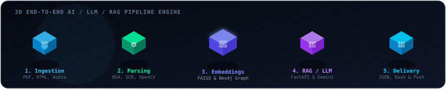

  

 

# Hi, I'm Tulsi Kumar Yadav 👋

### **Software Engineer • AI/ML Engineer • LLM & RAG Developer • Backend Engineer**

  
  &nbsp;
  
  &nbsp;
  
  &nbsp;
  
  &nbsp;
  

 

## ⚡ About Me

I am a software engineer focused on building practical AI systems, LLM/RAG applications, and scalable backend APIs. I enjoy turning complex machine learning research into clean, high-performance software.

 

<table width="100%">
  <tr>
    <td width="33%" valign="top">
      <h4>🤖 AI Systems</h4>
      
Building LLM applications, prompt engineering, and structured generation engines.

    </td>
    <td width="33%" valign="top">
      <h4>🔎 RAG Pipelines</h4>
      
Retrieval-Augmented Generation using embeddings, FAISS vector search &amp; Neo4j graphs.

    </td>
    <td width="33%" valign="top">
      <h4>⚙️ Scalable Backends</h4>
      
Designing high-throughput REST APIs and microservices with FastAPI and Django.

    </td>
  </tr>
</table>

 

  

 

## 🚀 Featured Projects

<table width="100%">

  <!-- Project 1 -->
  <tr>
    <td>
      <h3>🏢 LLM Regulatory Intelligence System</h3>
      
Automated RAG-powered regulatory compliance platform integrating document ingestion, vector retrieval, and Neo4j knowledge graphs to reduce manual compliance reporting effort by 60%.

      
<code>Python</code> • <code>FastAPI</code> • <code>LLMs</code> • <code>RAG</code> • <code>FAISS</code> • <code>Neo4j</code>

      
🔗 <a href="https://github.com/tulsikumar18/AI-Assisted-regulatory-For-Corep"><b>View Repository →</b></a>

    </td>
  </tr>

  <!-- Project 2 -->
  <tr>
    <td>
      <h3>🌾 AgriAid — Smart Agricultural Assistant</h3>
      
<b>🏆 1st Place Winner — Hacktopus Hackathon (50+ teams)</b>

      
Multimodal AI assistant supporting image, text, and voice inputs for real-time plant disease detection and multilingual advisory for rural accessibility.

      
<code>Python</code> • <code>FastAPI</code> • <code>Computer Vision</code> • <code>NLP</code> • <code>Gemini API</code>

      
🔗 <a href="https://github.com/tulsikumar18/AgriAid"><b>View Repository →</b></a> &nbsp;|&nbsp; 🎥 <a href="https://drive.google.com/file/d/13oJG7U6W43YkJlChiFagw9NCBynm2deI/view?usp=sharing"><b>Watch Demo Video</b></a>

    </td>
  </tr>

  <!-- Project 3 -->
  <tr>
    <td>
      <h3>🏛️ JanMitra — AI Civic Issue Reporting Platform</h3>
      
Mobile-first civic reporting app featuring Gemini Pro AI issue guidance, photo submission, map tagging, automatic priority detection, and Supabase RLS backend.

      
<code>React Native</code> • <code>Expo</code> • <code>Gemini Pro API</code> • <code>Supabase RLS</code>

      
🔗 <a href="https://github.com/tulsikumar18/JanMitra"><b>View Repository →</b></a> &nbsp;|&nbsp; 🎥 <a href="https://drive.google.com/file/d/1aYaxH5cLpfeuPLmhs3hzhXONh7Na-Wl_/view?usp=sharing"><b>Watch Demo Video</b></a>

    </td>
  </tr>

</table>

 

## 🧰 Core Stack &amp; Achievements

  
  
  
  
  
  
  
  

> 🏆 **1st Place Winner** — Hacktopus Hackathon 2025 (AgriAid • 50+ Teams)

 

## 📊 GitHub Activity

  
  &nbsp;
  

 

  

 

  <h3>Let's build something interesting.</h3>
  

    <a href="mailto:tulsikumaryadavamcec@gmail.com"><b>Get in Touch ✉️</b></a> &nbsp;|&nbsp;
    <a href="https://www.linkedin.com/in/tulsi-kumar-yadav-2b749627a"><b>Connect on LinkedIn 💼</b></a> &nbsp;|&nbsp;
    <a href="https://tulsikumar-portfolio.vercel.app"><b>Visit Portfolio 🌐</b></a>
  

 

  

